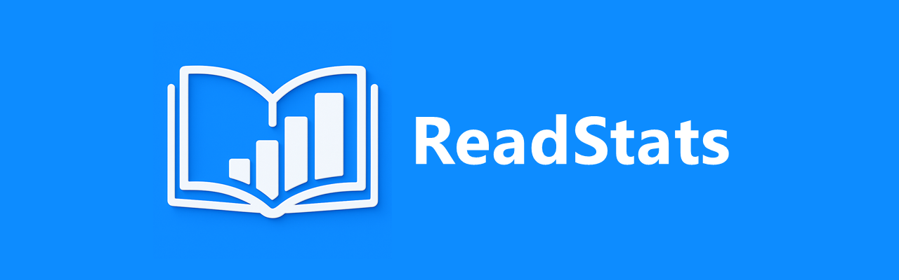
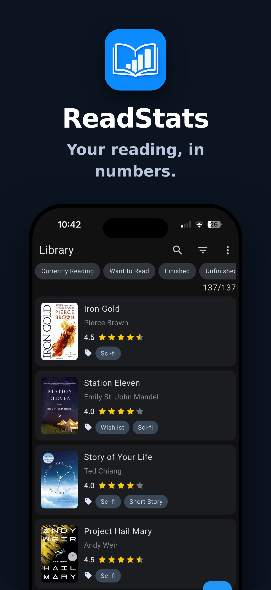
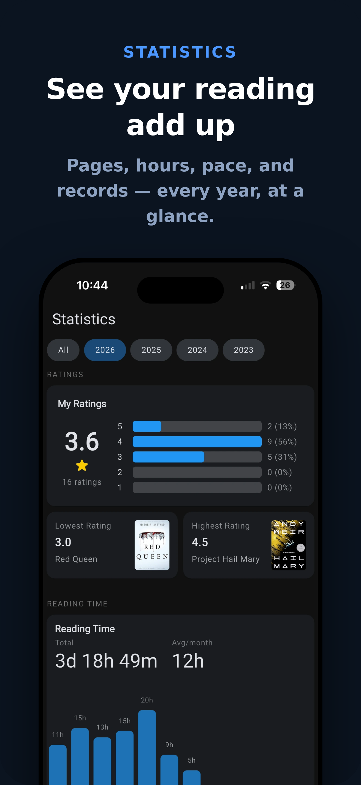
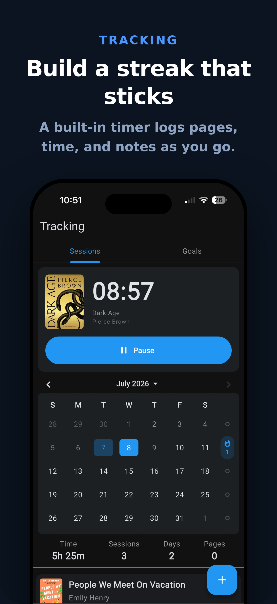
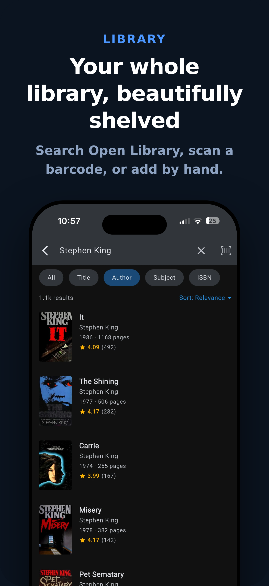
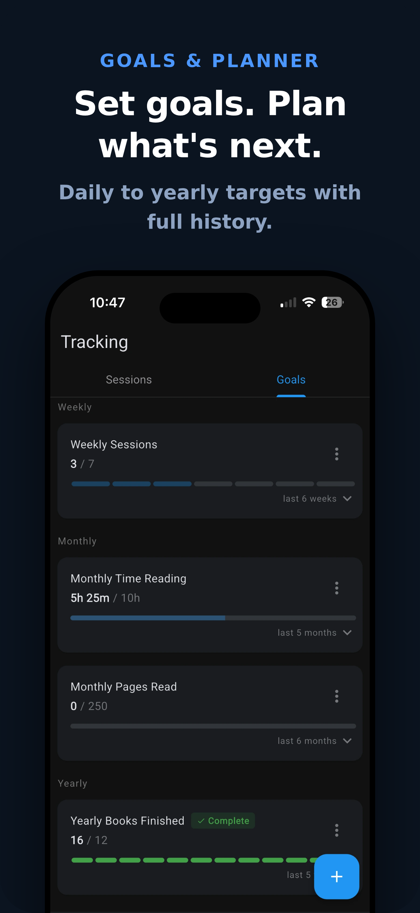
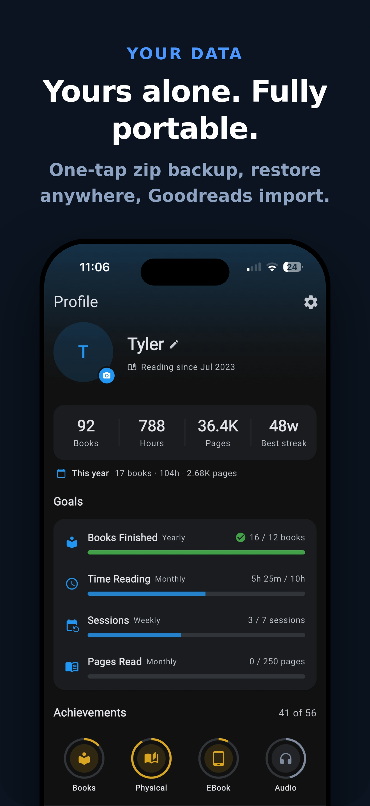
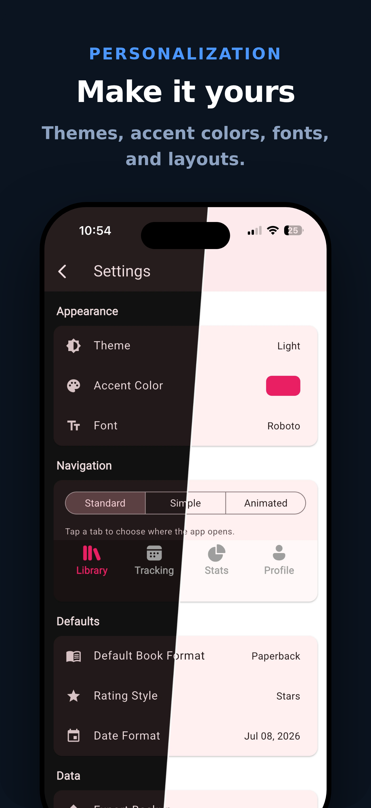

# ReadStats

<p align="center">
  
</p>

<p align="center">
  <b>Track your reading. Build the habit. Keep your data.</b>
</p>

<p align="center">
  <a href="https://apps.apple.com/app/id6748966946"></a>
  
  <a href="https://discord.gg/cA6CDkUY4x"></a>
  <a href="https://alternativeto.net/software/readstatsapp/about/"></a>
  <a href="https://github.com/sponsors/tyshoe"></a>
  <a href="https://buymeacoffee.com/tyshoe"></a>
</p>

<p align="center">
  <a href="https://apps.apple.com/app/id6748966946">
    
  </a>
</p>

---

ReadStats is a clean, private reading tracker. Log the books you read and the sessions you spend reading them, then watch your stats, streaks, and goals grow — all stored locally on your device, no account required.

<p align="center">
  
  
  
</p>
<p align="center">
  
  
  
  
</p>

## Features

### 📚 Library
- Add books by searching Open Library, scanning an ISBN barcode, or entering them manually
- Cover art from online search or your photo library
- Organize with shelves (plus your own custom shelves), tags, and favorites
- Rate with stars or precise decimal scores, and write reviews
- Grid and list views with rich sorting and filtering

### ⏱️ Tracking
- Log reading sessions with pages, time, and notes
- Built-in reading timer
- Reading goals — daily, weekly, monthly, or yearly targets with full history
- A planner to line up what you're reading next

### 📊 Statistics
- Reading stats by year: pages, time, books finished, and pace
- Records like fastest read, highest rated, and longest book
- Rating distributions and per-book session breakdowns
- Share cards for finished books

### 💾 Your data, portable
- One-tap backup: a single zip with all your data **including cover images**
- Restore your library on any device, any time
- Import your library from Goodreads (CSV)

### 🎨 Make it yours
- Light and dark themes with custom accent colors
- Multiple fonts, navigation styles, and date formats
- Set your default tab, book format, and rating style

## Privacy

ReadStats has no accounts, no ads, no analytics, and no servers. Everything you record lives in a local database on your device and leaves it only when *you* export a backup. The app only touches the network to look up books, download covers, and load fonts. Read the full [privacy policy](PRIVACY.md).

## Building from source

ReadStats is a [Flutter](https://flutter.dev) app.

```bash
git clone https://github.com/tyshoe/ReadStats.git
cd ReadStats
flutter pub get
flutter run
```

## Feedback & community

- 🐛 Found a bug or want a feature? [Open an issue](https://github.com/tyshoe/ReadStats/issues) or email [readstatsdev@gmail.com](mailto:readstatsdev@gmail.com)
- 💬 Join the [Discord](https://discord.gg/cA6CDkUY4x) to chat about the app
- ⭐ Enjoying ReadStats? A rating on the [App Store](https://apps.apple.com/app/id6748966946) helps a lot
- 👍 Help others find it: [upvote ReadStats on AlternativeTo](https://alternativeto.net/software/readstatsapp/about/) — it's the first place a lot of people look for a private, no-account reading tracker
- ❤️ Want to support development? [Sponsor on GitHub](https://github.com/sponsors/tyshoe) or [buy me a coffee](https://buymeacoffee.com/tyshoe)
